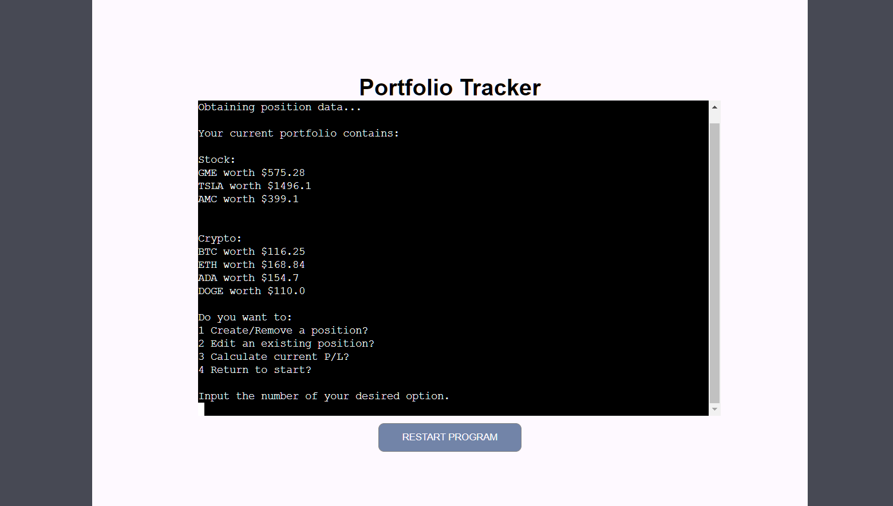
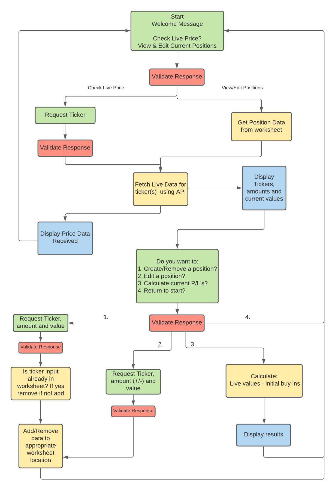
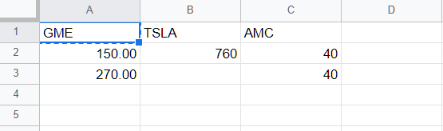
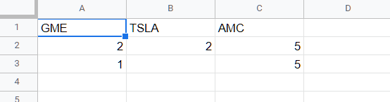
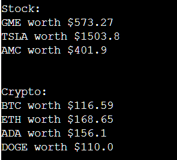
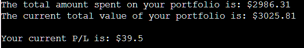

<a name="top"></a>

# Portfolio Tracker #
The porfolio tracker is a tool created as a way for investors of stock and crypto to easily monitor their investments and plot changes to a spreadsheet.

In order to do this on a regular basis manually this requires searching prices and calculating the changes manually or logging in and bouncing between several investment apps in order to track individual assets, as not all are supported in one location.

This idea comes from a personal desire for an app such, as this as I currently plot my own profits/losses through a spreadsheet which I have had to create and maintain manually. This project will aid in automating some of the processes that I carry out daily.



## Table of contents 

- [UX](#ux)
    - [User Goals](#user-goals)
    - [User Stories](#user-stories)
    - [Owners Goals](#owners-goals)
- [Design Choices](#design-choices)
    - [Flowcharts](#flowcharts)
    - [Wireframes](#wireframes)
- [Features](#features)
    - [Existing Features](#existing-features)
    - [Potential Future Feature](#future-features)
- [Data](#data)
    - [Structure](#structure)
    - [Calculations](#calculations)
- [Testing](#testing)
    - [PEP8](#validator)
    - [User Stories](#user-story-testing)
    - [Live Testing](#live-testing)
    - [Bugs](#bugs)
- [Deployment](#deployment)
    - [Local Deployment](#local-deployment)
    - [Heroku Deplyment](#heroku)
- [Technologies](#technologies)
- [Credits](#credits)

<a name="ux"></a>

## UX ##

<a name="user-goals"></a>

### User Goals ###
- I want a straighforward, intuitive system for displaying and inputting information.
- I want the website to fuction on PC, tablet and mobile devices.
- I want the information I input to be saved to a spreadsheet so I can review past postitions and profits.
- I need to be able to navigate between options quickly.

<a name="user-stories"></a>

### User Stories ###
- As a user, I would like to be able to load the tool and gain live stock/crypto data quickly.
- As a user, I would like to be able to input my recent asset purchases with them all saved to one location.
- As a user, I want to calculate my gains/losses based on my current positions.
- As a user, I need to be able to add/remove/edit my postitions.
- As a user, I would like to be able to check my overall realised profit/loss.
- As a user, I need the tool to be simple to use with a clear navigation system.
- As a user, I need to be able to return to the beginning quickly without reloading the page.

<a name="owners-goals"></a>

### Owners Goals ###
- To create a tool which accurately diplays live stock and crypto price data.
- To have a tool which saves the users data and uses it to provide accurate calculations on their profits and losses.
- To create a tool that is easy to navigate and use.
- To create a tool which validates all inputs to ensure the correct data types.

<a name="design-choices"></a>

## Design Choices ##

<a name="flowcharts"></a>

### Flowcharts ###
This flowchart tracks the basic steps and checks the program must make to run based on each of the user's potential requirements and inputs. 



Flowchart made using [Lucidchart](https://www.lucidchart.com)

Flowchart was adapted slightly as endpoints for portfolio editing options now return to the portfolio options chain rather than the start of the program. This eliminates some repitition if the user wishes to make multiple changes one after the other.

<a name="wireframes"></a>

### Wireframes ###
Wireframes for the project can be found below. As this project is command line based, designs will remain largely the same throughout with accomodations made for varying screensizes.


Wireframes made with [Balsamiq](https://balsamiq.com/wireframes/?gclid=Cj0KCQjws4aKBhDPARIsAIWH0JWJhO7hJAo7ksg21AUhhLgGy-mFt-Dwmx0BWkjgxQDdHdxY1u9snBkaAnwrEALw_wcB)

- [Desktop Wireframe](docs/wireframes/desktop-wireframe.png)

- [Tablet Wireframe](docs/wireframes/tablet-wireframe.png)

- [Mobile Wireframe](docs/wireframes/mobile-wireframe.png)

<a name="features"></a>

## Features ##

<a name="existing-features"></a>

### Existing Features ###
- Live stock/crypto price checker:
    - User can search all major stocks and cryptocurrency prices live without needing to have them in their own portfolio.
- Simple Command-Line Interface:
    - The tool is controlled using a simple terminal with basic input prompts all clearly explained to the user for easy navigation.
- Input validation:
    - All user inputs are validated to ensure the correct inputs are provided to prevent errors. This includes the correct format, amount of inputs and that all tickers searched are valid. Any incorrect inputs give feedback to the user explaining why it was wrong with examples of the correct input format.
- Saves and displays user's position sizes and buy-in prices:
    - Using Gspread and Google Sheets the user can input and edit their own positions which are saved for future use.
- Calculates current value of user's positions:
    - Using the user's portfolio values saved in spreadsheets along with live price data, the tool can calculate the value of each of the user's assets and total portfolio value.
- Calculates profit/loss of user's portfolio
    - Toll uses all previously mentioned data to calculate the overall profit or loss of the portfolio.
- Save realised gains and losses and add as positions are closed:
    - By inputting negative values and sell prices for position changes the user can log realised changes which are taken into consideration when calculating P/L.
- Restart Program button:
    - Should any unexpected errors occur, the tool has a restart program button to reboot the tool.

<a name="future-features"></a>

### Potential Future Features

- Expand functionality to currencies and commodities

- Calculate individual P/L for each asset

<a name="data"></a>

## Data ##

<a name="structure"></a>

### Structure ###
User's portfolio data is stored in a Google Sheets document. This document contains 4 worksheets, 2 relating to stock data and 2 for cryptocurrency data. Each pairing has a worksheet called ###-pos-positions and ###-amounts.

- The pos-positions worksheet stores tickers along with the prices at which the corresponding ticker was purchased at. Each row corresponds to an amount in the same cell position in the amounts worksheet.


- The amounts worksheet contains the amount of units of the stock or crypto which was bought at the corresponding price in the pos-positions sheet. Negative values in this sheet imply that a certain amount of the asset was sold at the price in its corresponding pos-positions cell.


Using these two sheets one can calculate the amount of money spent on each asset.
<a name="calculations"></a>

### Calculations ###

- When calculating live portfolio values above the tool:
    - Gets the sum total amount of each asset in the portfolio individually.
    - Gets the live price for each of the tickers in the portfolio.
    - Multiplies the live price by the amount held to get a live value.
    ```
    (total amount of asset held) * (live price of asset) = Value of asset held
    ```


- When calculating total amount spent on portfolio the tool:
    - Multiplies each individual amounts values for each ticker by its corresponding pos-position value to get the amount spend at that particular transaction. (not using any negative amounts as these indicate sales)
    - Add together each result for each ticker to get total spent per asset.
    - Add these values together for total spent on the portfolio.

- When calculating total current value of portfolio the tool:
    - Takes all the live values calculated earlier and adds them together to get the total current value.

- When calculating the current P/L of the portfolio the tool:
    - Takes previous valules calculated in last sections.
    - Checks for negative values in amounts sheet indicating sales. If any are present these are multiplied by their corresponding pos-positions price (and makes positive) which is the price it was sold at. These values are realised gains and so are not considered when calculating amount spent on the portfolio.
    - Amount spent on portfolio is subtracted from the current value of the portfolio.
    - Any realised gains are added the result of last step which gives the overall profit/loss of the portfolio.
    ```
    P/L = (Current_value - Money_spent) + Realised_gains
    ```

<a name="testing"></a>

## Testing ##

<a name="validator"></a>

### PEP8 ###
All Python files follow all PEP8 standards and requirements with no errors ocurring.

<a name="user-story-testing"></a>

### User Stories ###

- ### As a user, I would like to be able to load the tool and gain live stock/crypto data quickly. ###
    - This was one of the first considerations made when planning out the flowchart for this project. As such the first option provided to the user is to search live prices or check theri portfolio. So if the user only needs to jump on to quickly check live prices of a ticker they can do that without diving into the other options branch with a single step. Therefore the tool meets this user's needs and expectations.

- ### As a user, I would like to be able to input my recent asset purchases and have them all saved to one location. ###
    - The tool displays to the user which assets are currently in their portfolio before providing options to make changes. The user can then choose to add to those positions and can do so with a single data input of amount and price. This values are then saved to a spreadsheet organised into worksheets for buy/sell prices and amounts and separated between stock and crypto. This allows the user to have a record of their purchases and sales in one place and those records are accessible to the user through google drive should they require a more in depth review of their assets. Thus th tool satisfies this user's requirements.

- ### As a user, I want to calculate my gains/losses based on my current positions. ###
    - In the tool's main portfolio options tree the user has the ability to calculate the P/L for their portfolio. These options are easily accessible after selecting view portfolio from the home options of the app. A potential future feature listed is the ability to calculate individual P/L for each asset based on their current value and positions. The tool currently partially meets this user's requirements as it is capable of calculating overall gains/losses however the functionality could be expanded for more specific use cases in the future.

- ### As a user, I need to be able to add/remove/edit my postitions. ###
    - The user is given full control to add/remove/edit positions in their portfolio without ever having to interact with the Google sheet after its creation if they desire. Their options are split between creating and removing an entire position in one option branch and editing current positions through another branch. This allows the users to make changes on the fly as the buy or sell assets which the tool will immediately take into accound when making future calculations. The user also has the ability to correct errors by removing positions incorrectly added. So, this user's requirements are met in full by the tool.

- ### As a user, I would like to be able to check my overall realised profit/loss. ###
    - As mentioned above the portfolio options tree has the option to calculate the portfolio's profit/loss which takes into consideration their realised gains made by selling assets. This options give the user the total worth of the assets in their account currently and the total spent on the account as well as extra insights. An addition to meet this user's request more specifically would be to display the user's realised gains as a seperate value entirely as this corresponds to the amount of money the user has already gotten back from the portfolio. This small addition would allow the tool to meet the user's requirement more fully, currently they are partially met.

- ### As a user, I need the tool to be simple to use with a clear navigation system. ###
    - The tool is designed to make clear and concise requests of the user at all points. All input requests made of the user are given with clear instruction and examples of the format required in their response. All inputs are then validated and confirmed to be in the correct format. All errors thrown from incorrect information are written to give the user feedback as to their error and provide examples of expected responses. In several cases 2 inputs are requested at once as a measure to cut down on the amount of individual requests asked of the user in order to speed up use of the tool. The navigation options are clear and no branch results in a dead end. This user requirement is met in full.

- ### As a user, I need to be able to return to the beginning quickly without reloading the page. ###
    - After completing any options branch the user is always brought back to a point in which they have an option to return to the home options with a single or at most 2 inputs. This allows for quick and simle navigation of the app. Many options automatically return user to the previous options branch after completing their task and pproviding the desired information and feedback. This satisfies this user's requirements.

<a name="live-testing"></a>

### Live Testing ###
Once the tool was at a partially functional state it was forwarded to several friends and colleagues for live testing and as new features were added they were prompted to try the tool again and provide feedback. The main points of feedback received were:
- Some input responses could be more intuitive 
    - This related to the letter keys required for navigation as some were not as clear as they could be and though they were explained on screen, an intuitive naming convention would improve the user experience so some of these were changed eg type H to return to home or L for live prices

- Some information and instructions were hard to parse
    - With so much information and instructions being provided at times the terminal could get quite crowded leading to a block of text that became hard to read. The solutions for this were: 
        - To add additional newlines between many print statements and blocks of instructions to space out and provide separation for individual ideas.
        - To create a function which cleared the screen when certain options and actions were taken to remove old information. This kept the information in the terminal up to date and cut down on clutter.

<a name="bugs"></a>

### Bugs ###
Some notable bugs and their fixes found during development were:
- Live search function gave errors if the incorrect number of values were given
    - The solution to this was an extra step in the validation process which would later be used in all input requests that require more than one value. By using `response.split()` the user's response was made into a list which was then compared to the required amount of values requested in order to confirm the user has provided the right amount of values. This check is carried out before any other validation checks confirming the response content and format.
- Crypto searches causing errors due to formatting issue:
    - When searching for cryptocurrencies finnhub requires more than just the ticker name which stock searches take: `client.crypto_candles(asset, interval, time_start, time_end)` This required importing the time module and using it to pass finnhub the UNIX timecode for the present and the previous minute in order to get the last minutes price action. On top of this the ticker must be in the format of `BINANCE:tickerUDST` which required creating a function which wrapped the user's inputted ticker in the extra string data and removed it again for display purposes.
- Tickers and prices when being displayed to the user where all given within brackets:
    - This was due to results being formed in arrays which had to then be unpacked before outputting to the terminal using `list.pop()`

<a name="deployment"></a>

## Deployment ##
This project is deployed to [Heroku](https://www.heroku.com) which is where it is available to view publicly at [Live App](https://itsalank-portfolio-tracker.herokuapp.com/). The project was developed using [Gitpod](https://gitpod.io/) with Github serving as host for my respository. This project can be deployed locally using and IDE such as gitpod or remote to a hosting platform such as Heroku.

<a name="local-deployment"></a>

### Local Deployment ###
These are the steps needed in order to deploy this project locally through an IDE such as gitpod:

1) Clone the project. Navigate to the repository, above the window housing all of the application's files there is a code button which drops down into a clone window providing a link to clone the project. In your IDE terminal type the following using the link provided.
    ```
    git clone https://github.com/ItsAlanK/portfolio-tracker.git
    ```
2) Create a copy of [this Google Sheets](https://docs.google.com/spreadsheets/d/1jkYgwJytYImzk_7XiS8XRRuSqQnq5Ib9-Qs70vegv-Y/edit?usp=sharing) document in your own drive. (all data is dummy data and can be removed to add real data using app)
3) Create a [Google Cloud Platform](https://console.cloud.google.com/) account in order to use Google API's to access the Google sheets file.
    - Once your account is created, from your dashboard create a new project and name it whatever you wish your project to be called.
    - In the side menu select API's & services and go to the library to search for "Google Drive API"
    - Enable this API and click create credentials on the following page. The options required for this project are:
        - Google Drive API
        - Application Data
        - No compute Engine
        - Choose account name
        - Skip all other options except the Role Dropdown box choose Basic > Editor then press Continue
    - Next click the service account that was created and select keys and create a JSON file which you can save to your desktop and name creds.json (the name is important)
    - Then return to the API's library and search for "Google Sheets API" which only needs to be enabled.
4)  On [Finnhub.io](https://finnhub.io/) select get free API key, create an account and save the key provided.
5) Back in your newly cloned project in your IDE us `pip3 install -r requirements.txt` in the terminal to install all required libraries.
6) Next you must add your creds.json file which you downloaded into the main project folder and create a file named .env in which you must paste `FINNHUB_KEY = "key"` replacing the word key with your finnhub api key.
7) In your creds.json file copy the "client_email" address and in google sheets share your copy of the project spreadsheet to the email address. This allows the google API to access the file. (Note you must share it as and editor not a viewer)
8) By using `python3 run.py` in the terminal the project can now be run in your IDE

<a name="heroku"></a>

### Heroku Deployment ###

To deploy this project to Heroku to be used remotely:
1) Create an account with [Heroku](https://www.herokuapp.com)
2) Create a new project and give it a name.
3)Navigate to the settings page for your project and go to the config vars section
3) Here your must create 3 config vars
    - Key = `PORT` Value = `8000`
    - Key = `CREDS` Value = Copy and paste the contents of creds.json
    - Key = `PORT` Value = Copy and paste finnhub api key (key only
4) Below config vars in the add buildpacks section you must add the "Python" and "Node.js" buildpacks in that order
5) In your IDE confirm requirements.txt is up to date you using `pip freeze > requirements.txt` in the teminal.
6) Push all changes to your github repository
7) Back in Heroku navigate to the deploy page and link your GitHub account.
8) Select the branch of your project to deploy click deploy branch
Your project will deploy in a few moments and you will have a button to open your app.

<a name="technologies"></a>

## Technologies ##
Technologies used in this project:
- [Python](https://www.python.org/) is the main technology used in creating all the functionality of this tool using some libraries to expand it's capabilities.
- [HTML](https://developer.mozilla.org/en-US/docs/Web/HTML) and [Javascript](https://developer.mozilla.org/en-US/docs/Web/JavaScript) are used simply to house and launch the terminal and these files were created in the [template](https://github.com/Code-Institute-Org/python-essentials-template) used for the repo.
- [GSpread](https://docs.gspread.org/en/v4.0.1/) is used in order to receive and manipulate data found in the Google Sheets spreadsheets.
- [Google OAuth](https://developers.google.com/identity/protocols/oauth2) is required in order to use the Google API's to access the spreadsheets.
- [Finnhub.io](https://finnhub.io/) is the API used to access live price data for stocks and crypto.
- [Finnhub-python](https://github.com/Finnhub-Stock-API/finnhub-python) is a library used to extent the functionality of the finnhub API
- [Numpy](https://numpy.org/) is used in order to create and perform calculations with multidimensional arrays. This allows some of the more complex arithmetic required when adding or multiplying nested lists of values by their indices.

<a name="credits"></a>

## Credits ##
A big thanks to my Code Institute mentor [Simen Daehlin](https://dehlin.dev/#home) for his help preparing me for this project. And providing invaluable feedback and suggestions on how to improve it.

Thank you to my girlfriend Aoife for being my proofreader for the README which I desperately needed.

Thanks you friends and family who helped to troubleshoot and provided feedback for the project. (And suffer through my rambling as I try to solve problems)

- Flowchart made using [Lucidchart](https://www.lucidchart.com)

- Wireframes made with [Balsamiq](https://balsamiq.com/wireframes/?gclid=Cj0KCQjws4aKBhDPARIsAIWH0JWJhO7hJAo7ksg21AUhhLgGy-mFt-Dwmx0BWkjgxQDdHdxY1u9snBkaAnwrEALw_wcB)

- Font used for title is [Laot](https://fonts.google.com/specimen/Lato?query=lato)

- [Numpy](https://numpy.org/) used to simplify process of calculating using multidimensional arrays

- [Finnhub.io](https://finnhub.io/) used to get all live price data and ticker symbols

- [GSpread](https://docs.gspread.org/en/v4.0.1/) used to receive and edit spreadsheet data

[Back to top](#top)