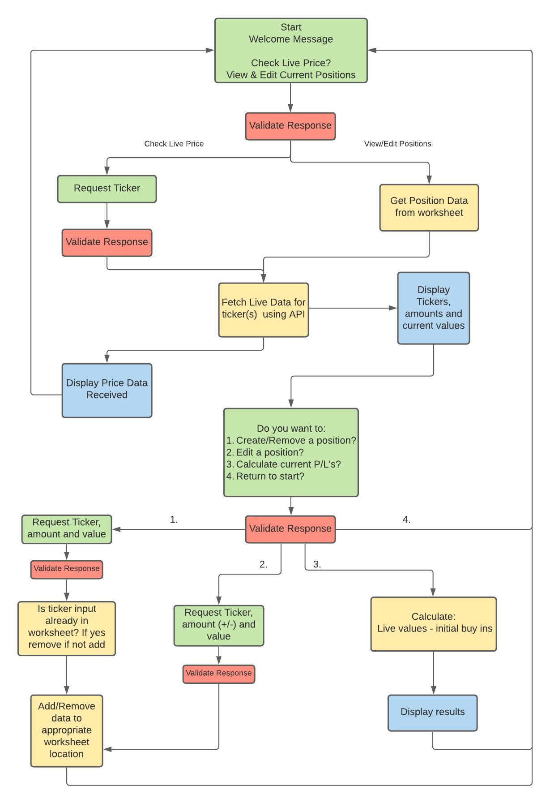
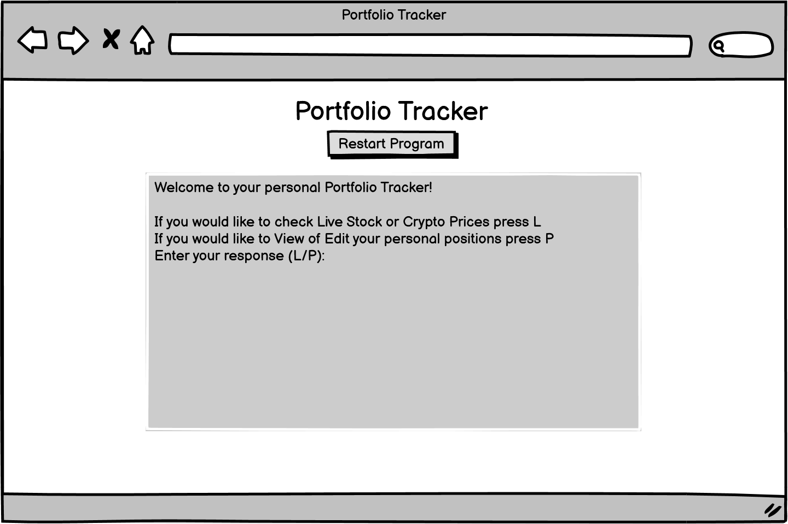

# Portfolio Tracker #
The porfolio tracker is a tool created as a way for investors of stock and crypto to easily monitor their investments and plot changes to a spreadsheet.

In order to do this on a regular basis manually this requires searching prices and calculating the changes manually or logging in and bouncing between several investment apps in order to track individual assets as not all are supported in one location.

This idea comes from a personal desire for an app such as this as I currently plot my own profits/losses through a spreadsheet which I have had to create and maintain manually. This project will aid in automating some of the processes that I carry out daily.

## UX ##
### User Goals ###
- I want a straighforward, intuitive system for displaying and inputting information.
- I want the website to fuction on pc, tablet and mobile devices.
- I want the information I input to be saved to a spreadsheet so I can review past postitions and profits.
- I need to be able to navigate between options quickly.

### User Stories ###
- As a user, I would like to be able to load the tool and gain live stock/crypto data quickly.
- As a user, I would like to be able to input my recent asset purchases and have them all saved to one location.
- As a user, I want to calculate my gains/losses based on my current positions.
- As a user, I need to be able to add/remove/edit my postitions.
- As a user, I would like to be able to check my overall realised profit/loss.
- As a user, I need the tool to be simple to use with a clear navigation system.
- As a user, I need to be able to return to the beginning quickly without reloading the page.

### Owners Goals ###
- To create a tool which accurately diplays live stock and crypto price data.
- To have a tool which saves the users data and uses it to provide accurate calculations on their profits and losses.
- To create a tool that is easy to navigate and use.
- To create a tool which validates all inputs to ensure the correct data types.

## Design Choices ##
### Flowcharts ###
This flowchart tracks to basic steps and checks the program must make to run based on each of the user's potential requirements and inputs. 

Flowchart made using [Lucidchart](https://www.lucidchart.com)

### Wireframes ###
Wireframes for the project can be found below. As this project is command line based designs will remain largely the same throughout with accomodations made for varying screensizes.

Wireframes made with [Balsamiq](https://balsamiq.com/wireframes/?gclid=Cj0KCQjws4aKBhDPARIsAIWH0JWJhO7hJAo7ksg21AUhhLgGy-mFt-Dwmx0BWkjgxQDdHdxY1u9snBkaAnwrEALw_wcB)

- [Desktop Wireframe](docs/wireframes/desktop-wireframe.png)

- [Tablet Wireframe](docs/wireframes/tablet-wireframe.png)

- [Mobile Wireframe](docs/wireframes/mobile-wireframe.png)

## Features ##
### Existing Features ###
- Live stock/crypto price checker
- Simple Command-Line Interface
- Input validation
- Saves and displays user's position sizes and buy-in prices
- Calculates current value of user's positions
- Calculates profit/loss of user's portfolio
- Restart Program button

### Potential Future Features
- Save realized gains and losses and add as positions are closed
- Expand functionality to currencies and commodities

## Testing ##

### Validator Testing ###

### Bugs ###

## Deployment ##

## Technologies ##

## Credits ##
